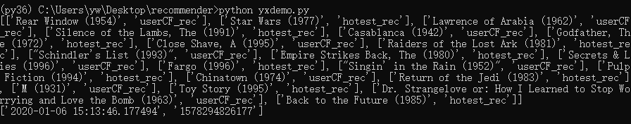
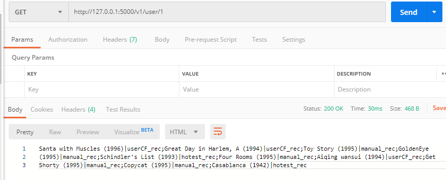
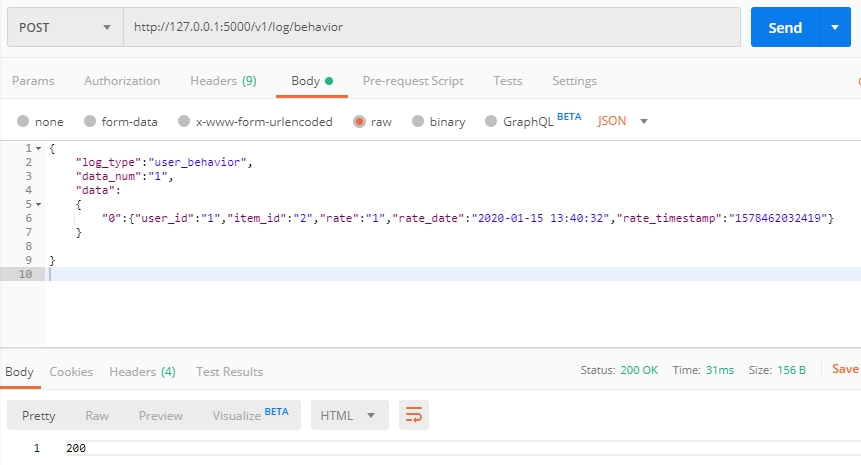

# RecommendationSystemDemo

基于Surprise实现的具有完整功能的推荐系统服务，并利用flask框架实现了简单的接口调用。

封装了完整的更新日志数据、训练、根据id查询推荐结果等功能。

包含了常见的SVD、FM等算法。


### 一、文件说明：
> python版本：3.6

> requirements.txt在yx_recommender_system下

* my_data: 本地用于测试的电影数据
* yx_recommender_system: 封装好的推荐系统核心代码，对web服务调用者透明。
* demo_server.py: web服务服务端代码。
* server_implement.py: 推荐服务功能实现。
* demo_client.py: 客户端代码，因不一定用python调用所以暂未实现。
* yxdemo.py: 调用推荐系统的参考demo，执行结果参考如下：


分别是推荐给用户id为1的电影列表（综合了热门物品推荐结果和基于用户协同过滤算法推荐结果），以及上一次训练的时间。

### 二、使用说明

运行服务端代码即可：

```python
python demo_server.py
```

客户端通过restfulAPI访问，示例如下：

#### 1. 获取推荐结果
使用GET访问 http://127.0.0.1:5000/v1/user/<user_id>
<user_id>即查询的用户id，例如：
> http://127.0.0.1:5000/v1/user/1

返回推荐结果的字典字符串。



#### 2. 上传行为日志
使用POST访问 http://127.0.0.1:5000/v1/log/behavior

返回200代表成功，400代表错误。

body参考：

```
{	
	"log_type":"user_behavior",
	"data_num":"1",
	"data":
	{
		"0":{"user_id":"1","item_id":"2","rate":"1","rate_date":"2020-01-15 13:40:32","rate_timestamp":"1578462032419"}
	}
	
}

```




### 三、推荐系统说明
#### 3.1 开放API

可参考yxdemo.py。

```python
#导入
import yx_recommender_system.recommender_system as yxrs

#类的初始化
rs_test = yxrs.YXRecommenderSystem(dir_csv_data="xx/data/",
                        dir_csv_recs="xx/recs/",
                        dir_csv_logs="xx/logs/")
#初始化时需要指定保存数据csv文件、推荐结果文件、日志文件的文件夹路径。


#获取协同过滤算法的评价指标值
rs_test.runTest(test_type = "user_rate")
#test_type = "user_rate","coverage" 分别测试协同过滤推荐的RMSE和覆盖率

#执行推荐算法训练
rs_test.runTrain()
   

#根据user_id查询推荐结果列表
rs_test.getRecommendByUserID(user_id = 1)


#获取上一次执行推荐算法训练的时间
rs_test.getLastTrainTime()

#更新手动推荐物品
rs_test.updateManualSet(update_log)
#update_log:暂定python字典 e.g.update_log = {'item_list':[1,2,3,4,5,6,7,8,9]}

#更新日志
update_item_log = '{"item_list":"1,2,3,4,5","update_user":"admin","remark":"test"}'
rs_test.updateManualSet(update_item_log)
    
user_behavior_log = '{"user_id":"1","item_id":"1","rate":"1","rate_date":"2020-01-08 13:40:32","rate_timestamp":"1578462032419"}'
rs_test.updateUserBehavior(user_behavior_log)

user_log = '{"user_id":"10000","user_name":"Test2","update_date":"2020-01-08 13:40:32","update_timestamp":"1578462032419"}'
rs_test.updateUser(user_log)

item_log = '{"item_id":"10000","item_name":"Test","update_date":"2020-01-08 13:40:32","update_timestamp":"1578462032419"}'
rs_test.updateItem(item_log)
```

#### 3.2 算法测试
在Surprise提供的算法基础上加入了经典的FM算法，使用的是xlearn库实现。

* 测试数据集：movielens 10000条评论数据
* 评价指标：RMSE
* 运行环境：CPU i5-8400

算法|结果(RMSE)|运行时间(s)
---|---|---
Random|1.9664|0.01
NormalPredictor|1.5186|0.21
KNNBasic|0.9872|2.96
KNNWithMeans|0.9629|3.18
KNNWithZScore|0.9631|3.38
KNNBaseline|0.9419|3.72
SVD|0.9475|3.80
SVDpp|0.9286|141.13
NMF|0.9741|4.22
CoClustering|0.9695|1.63
FM|0.9923|2079


### 四、相关资源

* [Surprise:A Python scikit for building and analyzing recommender systems](https://github.com/NicolasHug/Surprise)
* [xlearn:High performance, easy-to-use, and scalable machine learning (ML) package](https://github.com/aksnzhy/xlearn)
* [推荐系统资料笔记收录](https://github.com/fire717/Recommendation-system)
